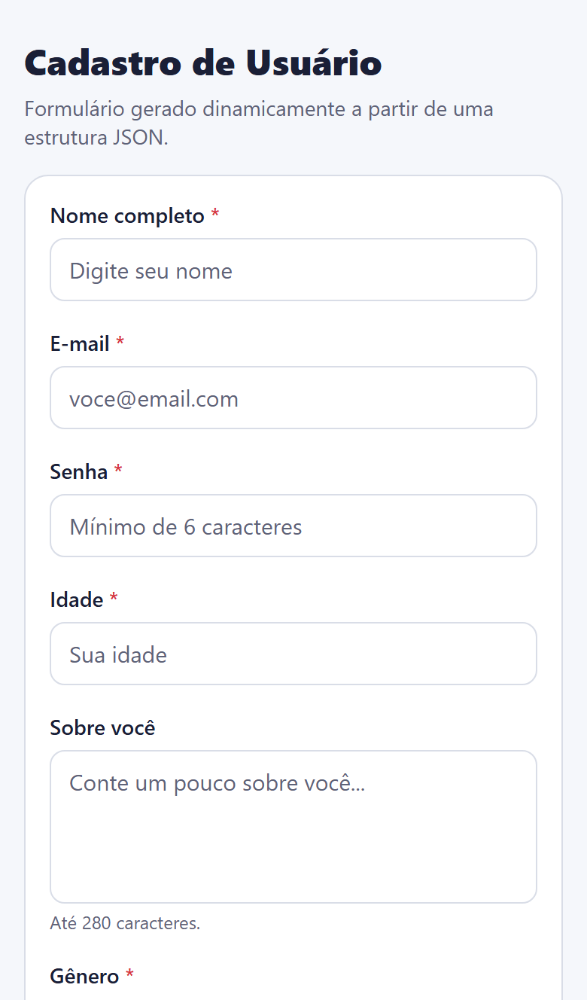
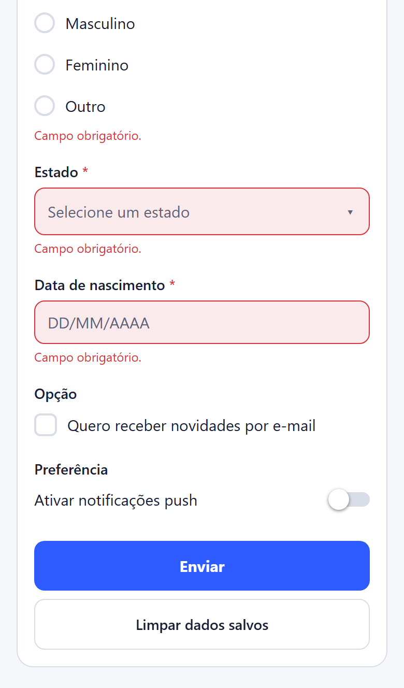
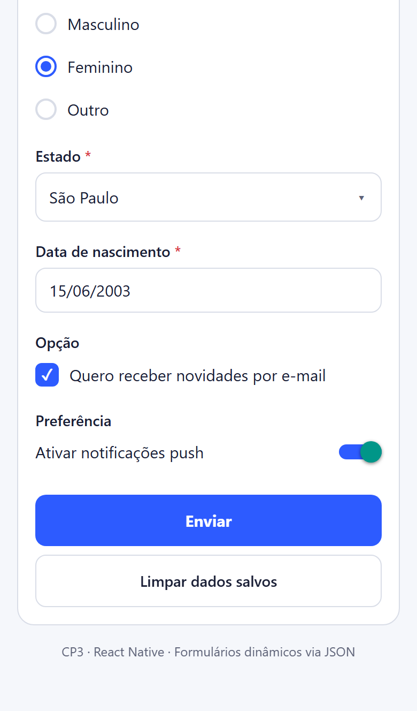
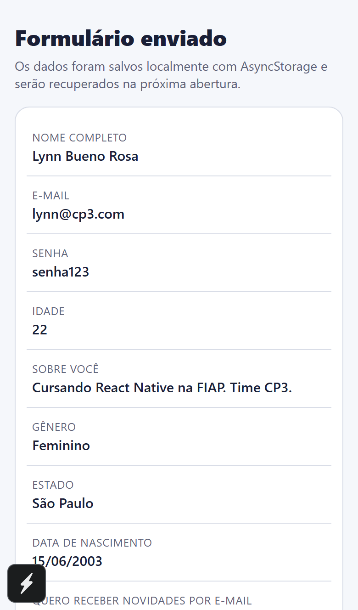

# CP3 — Formulários Dinâmicos (React Native + Expo SDK 55)

Aplicativo mobile multiplataforma (Android · iOS · Web) que renderiza um formulário inteiramente a partir de uma estrutura JSON. Nenhum campo é criado manualmente na UI — o componente `FieldRenderer` percorre `formConfig.fields` e decide qual componente desenhar para cada tipo.

## Descrição

O projeto cumpre os requisitos do Checkpoint 3 da disciplina de **Desenvolvimento Mobile com React Native**:

- O array `fields` do JSON é percorrido e cada item é renderizado pelo componente compatível com o `type`.
- Os valores são controlados em estado central no hook `useDynamicForm`.
- Validação de obrigatoriedade, formato (e-mail, data, número) e limites (min/max/length).
- Persistência local com `AsyncStorage`: ao submeter os dados são salvos; ao reabrir o app, são recuperados; há um botão para limpar.
- Após o submit, o usuário é levado para uma tela de resultado mostrando o resumo dos dados enviados.

## Tecnologias utilizadas

- **React Native** 0.81
- **Expo SDK** 55 (`expo start`, `expo start --web`)
- **TypeScript** 5.6 (strict, sem `any`)
- **AsyncStorage** (`@react-native-async-storage/async-storage`) para persistência local
- **react-native-web** para a build web

## Como executar o projeto

> Pré-requisitos: Node.js LTS (≥ 18.18, recomendado 20+), npm. Para abrir no celular, instalar o app **Expo Go** na Play Store/App Store.

```bash
# 1. Instalar dependências
npm install

# 2. Iniciar em modo desenvolvimento (Android / iOS via Expo Go)
npx expo start

# 3. Rodar no navegador (Web)
npx expo start --web

# Atalhos úteis após o `expo start`:
#   a → abre no Android (emulador/Expo Go)
#   i → abre no iOS Simulator (apenas macOS)
#   w → abre no navegador
```

Para validar tipos sem rodar o app:

```bash
npm run typecheck
```

## Estrutura de pastas

```
CP3-FormulariosDinamicos/
├── App.tsx                       # Componente raiz; alterna FormScreen ↔ ResultScreen
├── index.ts                      # Entry point (registerRootComponent)
├── app.json                      # Configuração Expo
├── package.json
├── tsconfig.json
├── babel.config.js
└── src/
    ├── components/
    │   ├── FieldRenderer.tsx     # Dispatcher: lê field.type e escolhe o componente
    │   ├── FieldWrapper.tsx      # Label + helper text + mensagem de erro
    │   ├── TextInputField.tsx    # text / email / password / number / textarea / date
    │   ├── RadioField.tsx
    │   ├── SelectField.tsx       # Dropdown custom com Modal
    │   ├── CheckboxField.tsx
    │   └── SwitchField.tsx
    ├── config/
    │   └── formConfig.ts         # ★ A estrutura JSON que define o formulário
    ├── hooks/
    │   └── useDynamicForm.ts     # Estado, validação, submit, reset (useState/useEffect/useMemo/useCallback)
    ├── screens/
    │   ├── FormScreen.tsx
    │   └── ResultScreen.tsx
    ├── services/
    │   └── storage.ts            # AsyncStorage: save / load / clear
    ├── theme/
    │   └── colors.ts             # Paleta da UI
    ├── types/
    │   └── form.ts               # Tipos discriminados de cada campo
    └── utils/
        ├── initialValues.ts      # Cria values iniciais a partir do config
        └── validators.ts         # Regras de validação por tipo de campo
```

## Como mudar o formulário (sem tocar em componente nenhum)

Edite somente [`src/config/formConfig.ts`](src/config/formConfig.ts). Exemplo de um campo:

```ts
{
  id: 'email',
  label: 'E-mail',
  type: 'email',
  required: true,
  placeholder: 'voce@email.com',
}
```

Tipos suportados: `text`, `email`, `password`, `number`, `textarea`, `date`, `radio`, `select`, `checkbox`, `switch`.

## Hooks obrigatórios — onde estão

- `useState` → [`useDynamicForm.ts`](src/hooks/useDynamicForm.ts) (values, errors, status, isSubmitting), `FormScreen`, `App.tsx`
- `useEffect` → [`useDynamicForm.ts`](src/hooks/useDynamicForm.ts) (hidratação do AsyncStorage no mount)
- `useMemo` → [`useDynamicForm.ts`](src/hooks/useDynamicForm.ts) (initialValues), [`TextInputField.tsx`](src/components/TextInputField.tsx) (config derivada), [`ResultScreen.tsx`](src/screens/ResultScreen.tsx) (linhas)
- `useCallback` → [`useDynamicForm.ts`](src/hooks/useDynamicForm.ts) (setValue, submit, reset), `FieldRenderer`, `FormScreen`, `App.tsx`

## Prints da aplicação

Capturas reais geradas com Playwright a partir do build web (`npx expo start --web`), viewport iPhone 13.

| Estado | Print |
| --- | --- |
| Formulário inicial (campos vazios) |  |
| Validação obrigatória (submit sem preencher) |  |
| Formulário preenchido |  |
| Resultado após submit (dados gravados em AsyncStorage) |  |

Para regerar os prints depois de alterar a UI:

```bash
npm install --no-save playwright
npx playwright install chromium
# em outro terminal: npx expo start --web --port 8081
node scripts/screenshot.mjs
```

## Integrantes

- Gustavo Oliveira de Moura — RM555827
- Giovanne Charelli Zaniboni Silva — RM556223
- Lynn Bueno Rosa — RM551102
- Leonardo Baldaia — RM557416

## Referências

- https://reactnative.dev/docs/components-and-apis
- https://docs.expo.dev/
- https://www.typescriptlang.org/docs/
- https://react-native-async-storage.github.io/async-storage/
